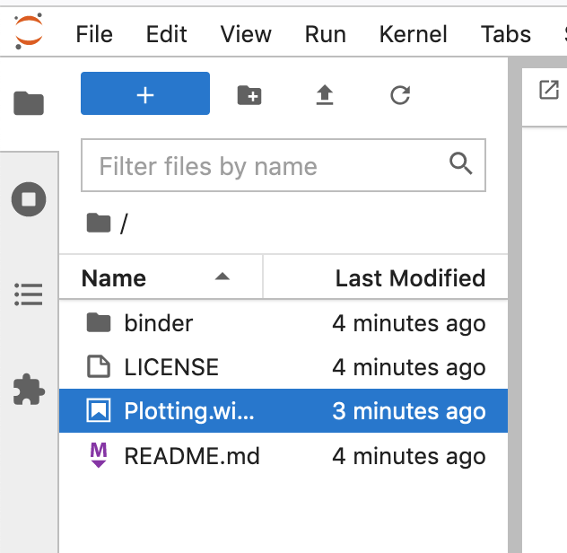
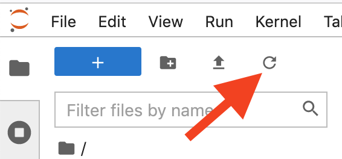

# Teaching Resources for Bioinformatics 1

## First steps into programming with R
In reality, RNAseq (and all other) analyses are not done in Excel but using programming languages such as R or python. Here, you will get a very first glimpse into the programming language [**R**](https://www.r-project.org/about.html). 
As a final part of this bioinformatic practical, you will run a short `R` script to recreate Figure 11 (the MA-plot) and also to plot boxplots for all the genes significantly different (FDR<0.05) between the queens and larvae.

To start, click on the following badge and open an interactive jupyter notebook, which allows you to run R code on a remote server:

<!-- - Launch in RStudio:  -->

Once the server has started, open the file `Plotting.with.R.ipynb` from the left list of files and follow the instructions in it.

 

If you can't see any files, try the refresh button: 

And don't worry, you can't break anything.

